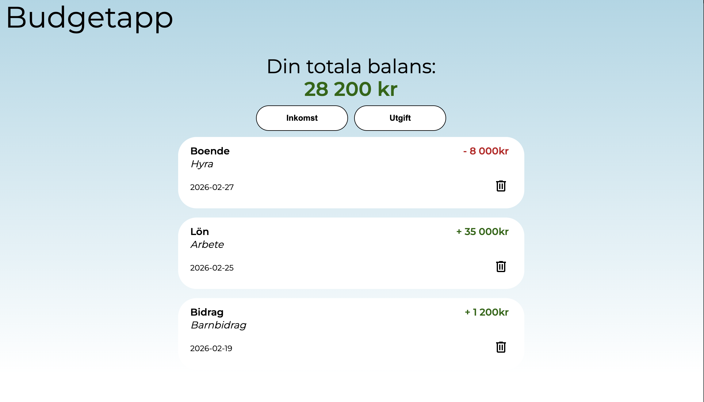
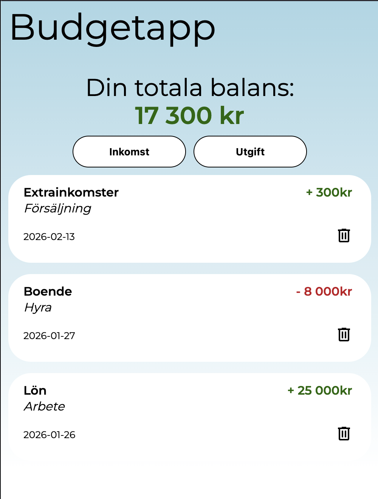
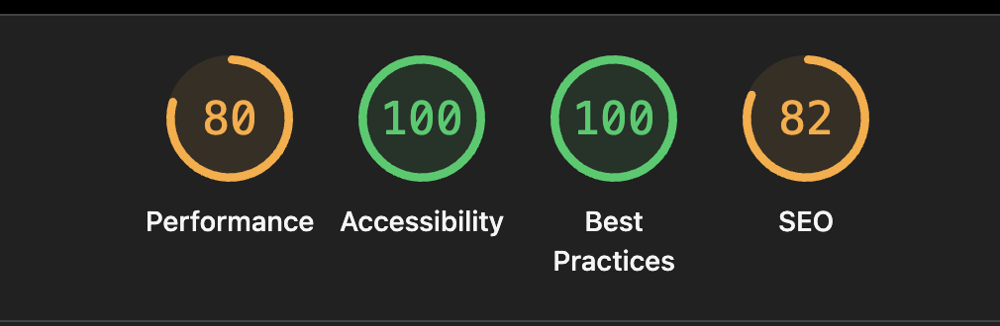

       

# Beskrivning av projektet

Ett projekt i kursen JavaScript-introduktion där uppgiften var att skapa en funktionell budgetapplikation. Användaren kan lägga till och ta bort inkomster samt utgifter, och se en sammanställning av sin ekonomi.

Funktionalitet:

    Användaren kan lägga till och ta bort inkomster och utgifter med beskrivning, belopp och kategori. Budgetposten färgkodas för att tydligt skilja på inkomster och utgifter.

    En totalsumma beräknas automatiskt och färgkodas (grön/röd) baserat på om beloppet är positivt eller negativt.

    All data sparas i localStorage och laddas automatiskt när sidan öppnas igen.

    Kategorier för inkomster och utgifter läses in via en JSON-fil.

Tekniskt fokus: Huvudfokus i projektet har varit logik, datahantering och funktionalitet framför avancerad CSS.

    Vite & TypeScript: Projektet är initierat med Vite och typat med TypeScript.

    SASS: Använt för att strukturera CSS på ett mer effektivt sätt.

## Skärmdumpar av projektet

## Tillgänglighetsanalys

Skärmdump av tillgänglighetsanalys i Chrome Lighthouse, mobilt läge: 

Skärmdump av tillgänglighetsanalys i Chrome Lighthouse, desktop-läge: 

## Validering

Sidan har validerats med hjälp av W3C HTML Validator, W3C CSS Validator samt
